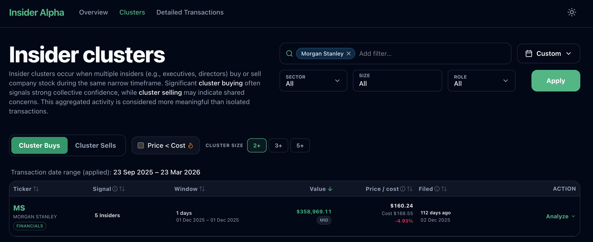
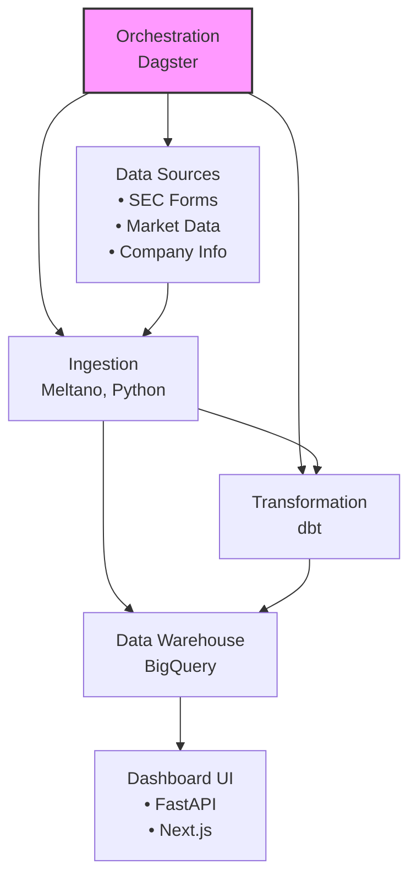
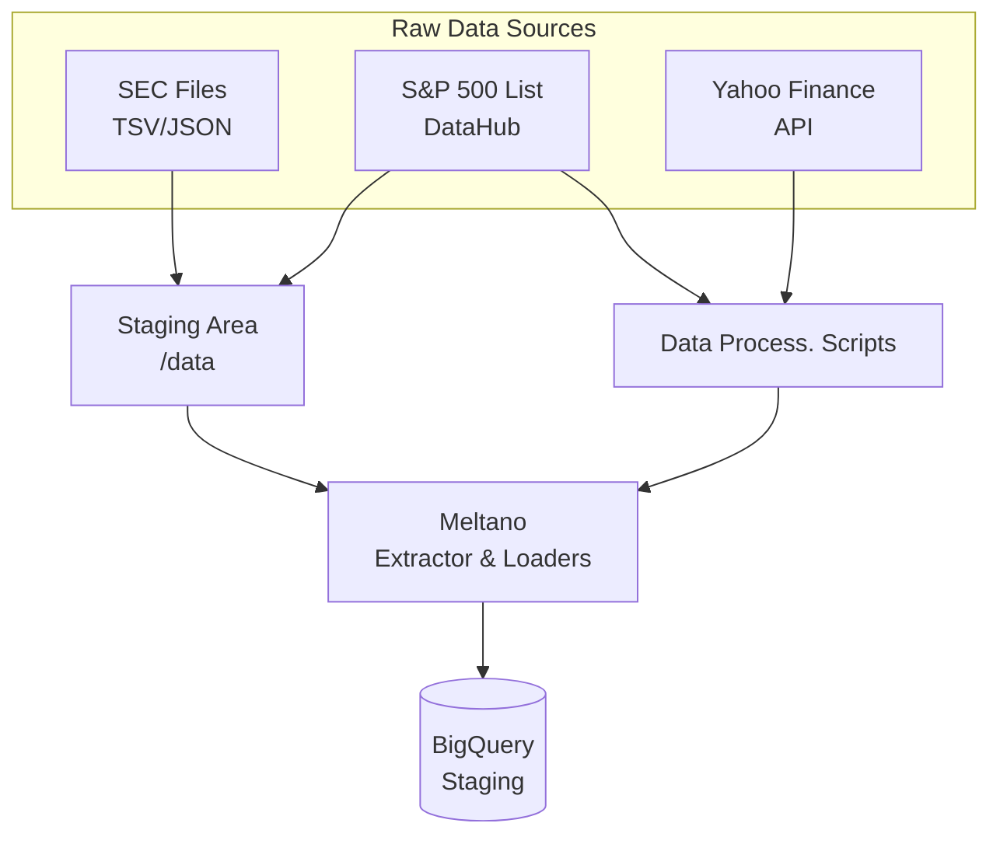
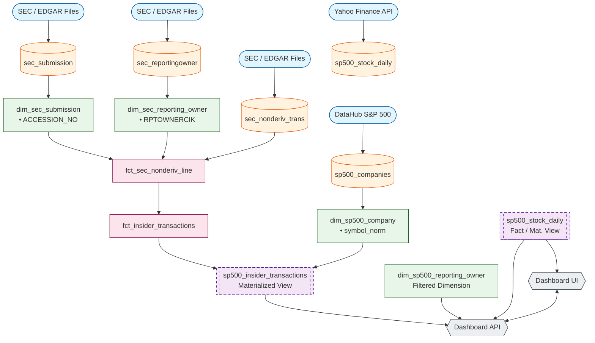

# NTU DSAI Capstone Project (Module 2: Data Engineering)

## Stock Analytics Data Pipeline with Insider Trading Dashboard

### Project Overview

This project is a comprehensive Stock Analytics Data Pipeline designed to ingest, process, and analyze financial market data and SEC insider trading information. Built as part of the NTU DSAI Module 2 Capstone, it automates the end-to-end flow from raw data extraction to analytics-ready models in Google BigQuery, complete with a modern dashboard UI for visualization and analysis.

### Business Value Proposition: Insider Alpha

**Executive Summary**

**Insider Alpha** is a specialized analytics dashboard that turns complex SEC Form 3 and Form 4 filings into actionable investment signals. It gives Portfolio Managers a systematic, data-driven edge by highlighting high-conviction trades from corporate insiders who have asymmetric access to information about their firms.

**The Problem**

While SEC filings are public, their sheer volume makes it virtually impossible for investors to manually track and identify high-conviction trades, meaning they often miss out on legal insider activity that predicts price movements.

**The Solution**

Insider Alpha consolidates SEC filings for S&P 500 constituents and filters out administrative "noise". It identifies key signals by prioritizing executive trades (CEOs, CFOs), detecting significant clustered purchases, and highlighting alpha opportunities in the critical 1-6 month post-filing window.

[Download Insider Alpha Business Value Proposition (PDF)](docs/InsiderAlpha.pdf)



### Architecture Overview


The pipeline follows a modern ELT (Extract, Load, Transform) architecture orchestrated by Dagster:



**Note**: The diagram shows the data flow architecture. Dagster orchestrates ingestion, transformation, and scheduling. dbt performs transformations within BigQuery (no UI), while the Dashboard UI provides the user-facing visualization layer.

### Data Processing Flow

The pipeline implements a sophisticated ELT workflow orchestrated by Dagster:

1. **Data Ingestion (Extract & Load)**:
  - **Meltano** extracts raw data from multiple sources (SEC EDGAR, Yahoo Finance, DataHub)
  - Loads processed data into Google BigQuery staging tables with optimized clustering
  - Handles both batch and incremental data updates
2. **Data Transformation**
  - **dbt** transforms raw staging data into structured dimension and fact tables
  - Cleans, deduplicates, and models data into structured dimension and fact tables
  - Implements business logic for financial calculations and aggregations
3. **Pipeline Orchestration**
  - **Dagster** coordinates ingestion, transformation, and scheduling
  - Provides monitoring, scheduling, and error handling capabilities
  - Offers both CLI and web-based UI for pipeline management
4. **Data Visualization**
  - **FastAPI + Next.js** provides modern analytics dashboard
  - Real-time query of transformed data with caching and optimization
  - Interactive charts and cluster analysis for investment insightsics
  - Multi-layer caching ensures responsive user experience

### Data Sources & Ingestion Process

#### Primary Data Sources

1. **SEC Form 3 & 4 Insider Trading Data**
  - **Source**: SEC EDGAR database (quarterly TSV datasets & daily XML indexes)
  - **Content**: Form 3 (Initial Statement of Ownership) and Form 4 (Statement of Changes in Beneficial Ownership)
  - **Update Frequency**: Mixed (Quarterly bulk + Daily incremental)
  - **Ingestion Method**: Automated download via `scripts/download_sec.py` and daily sync via `scripts/download_sec_form4_daily.py` (updated for Form 3/4)
  - **Data Volume**: ~1M+ records per year across all public companies
2. **S&P 500 Market Data**
  - **Source**: DataHub S&P 500 constituents ([https://datahub.io/core/s-and-p-500-companies/_r/-/data/constituents.csv](https://datahub.io/core/s-and-p-500-companies/_r/-/data/constituents.csv))
  - **Content**: Company symbols, names, GICS sectors, CIK mappings, headquarters locations
  - **Update Frequency**: Monthly (configurable via script)
  - **Ingestion Method**: `scripts/download_sync_sp500_companies.py` with JSONL conversion for Meltano
  - **Data Volume**: ~500 constituents with full company metadata
3. **Market Price Data**
  - **Source**: Yahoo Finance API via yfinance library
  - **Content**: Daily OHLCV data for S&P 500 constituents
  - **Update Frequency**: Daily (configurable)
  - **Ingestion Method**: `scripts/get_stock_data_yfinance.py` with incremental updates
  - **Data Volume**: ~500 constituents × daily price history

#### Data Ingestion Architecture



### Data Warehouse Design

#### BigQuery Schema Architecture

The data warehouse follows a star schema pattern with optimized clustering:



#### Table Design Principles

1. **Staging Tables**: Raw data with minimal transformation
  - `sec_submission`, `sec_reportingowner`, `sec_nonderiv_trans`
  - `sp500_companies`, `sp500_stock_daily`
  - Clustered on primary keys for efficient loading
2. **Dimension Tables**: Cleaned, deduplicated reference data
  - Primary key constraints and comprehensive testing
  - Business logic applied (role classification, date parsing)
  - Optimized for frequent joins and filtering
3. **Fact Tables**: Transactional data with aggregations
  - Grain defined at accession number level
  - Pre-calculated metrics for performance
  - Comprehensive business rules applied
4. **Materialized Views**: Performance-optimized query tables
  - `sp500_insider_transactions` with partitioning and clustering
  - `sp500_stock_daily` with clustering on symbol and date
  - Denormalized for fast API access
  - Refreshed incrementally

### ELT Pipeline Transformations

#### Data Transformation Logic

The dbt transformation layer implements sophisticated financial data processing:

#### 1. SEC Data Cleaning and Standardization

**Date Normalization Macro** (`parse_sec_date`):

```sql
-- Handles multiple date formats from SEC data:
-- • DD-MON-YYYY (31-MAR-2023)
-- • YYYY-MM-DD (2023-03-31) 
-- • YYYYMMDD (20230331)
-- • Numeric formats (20230331.0)
-- • ISO formats with various separators
```

**Transaction Code Classification**:

```sql
-- Maps SEC transaction codes to business meanings:
-- 'P' → 'Purchase'
-- 'S' → 'Sale'
-- Other codes → NULL (filtered out)
```

#### 2. Dimension Table Transformations

`**dim_sec_submission**`:

- **Deduplication**: Removes duplicate accession numbers using ROW_NUMBER()
- **Date Parsing**: Standardizes filing dates across multiple formats
- **Data Validation**: Ensures data quality with NOT NULL constraints

`**dim_sec_reporting_owner`**:

- **Role Classification**: Categorizes insiders as Director, Officer, 10% Owner, or Other
- **Name Standardization**: Trims and normalizes owner names and titles
- **Relationship Parsing**: Extracts role information from free-text relationships

`**dim_sp500_company`**:

- **Symbol Normalization**: Standardizes ticker symbols to uppercase
- **CIK Mapping**: Links SEC CIK numbers to trading symbols
- **Sector Classification**: GICS sector assignment for industry analysis
- **Purpose**: Used to filter SEC insider transactions to S&P 500 companies only

`**dim_sp500_reporting_owner`**:

- **S&P 500 Filtering**: Subset of `dim_sec_reporting_owner` for S&P 500 insiders only
- **Accession Filtering**: Only includes owners who transacted in S&P 500 companies
- **Performance Optimization**: Enables efficient cluster analysis and breakdown queries

#### 3. Fact Table Aggregations

`**fct_sec_nonderiv_line`**:

- **Line-level Processing**: Individual transaction line normalization
- **Value Calculations**: Computes transaction values (shares × price)
- **Data Validation**: Ensures non-negative share counts and prices

`**fct_insider_transactions`**:

- **Filing-level Aggregation**: Rolls up transactions to accession number grain
- **Derived Metrics**:
  - `total_shares_acquired/disposed`: Aggregate transaction volumes
  - `est_acquire/dispose_value`: Calculated transaction values
  - `total_non_deriv_shares_owned`: Post-transaction holdings
- **Owner Aggregation**: Consolidates multiple reporting owners per filing
- **Transaction Type Classification**: Labels purchase/sale activities

#### 4. Performance-Optimized Materializations

`**sp500_insider_transactions`**:

- **Partitioning**: Yearly partitioning on `TRANS_DATE` for efficient time-series queries
- **Clustering**: Multi-column clustering on `TRANS_DATE` and `symbol_norm` for fast lookups
- **Denormalization**: Pre-joins company and sector information for API performance
- **Incremental Updates**: Efficiently processes new data without full refresh

#### Key Derived Columns


| Column                  | Source                | Calculation                                    | Business Meaning             |
| ----------------------- | --------------------- | ---------------------------------------------- | ---------------------------- |
| `filing_date_key`       | FILING_DATE           | FORMAT_DATE('%Y%m%d', FILING_DATE)             | Date key for efficient joins |
| `total_shares_acquired` | TRANSACTION_SHARES    | SUM(CASE WHEN code='A' THEN shares ELSE 0 END) | Total purchased shares       |
| `est_acquire_value`     | SHARES × PRICE        | SUM(shares × price for purchases)              | Estimated purchase value     |
| `role_type`             | RPTOWNER_RELATIONSHIP | Pattern matching on text                       | Insider role classification  |
| `symbol_norm`           | ISSUERTRADINGSYMBOL   | UPPER(TRIM(symbol))                            | Normalized ticker symbol     |


### Data Quality Testing

#### Comprehensive Testing Framework

The pipeline implements multi-layer data quality assurance:

#### 1. Schema-Level Tests

**Primary Key Validation**:

```yaml
- name: ACCESSION_NUMBER
  tests:
    - unique      # Ensures no duplicate filings
    - not_null    # Ensures all filings have accession numbers
```

**Referential Integrity**:

```yaml
- name: RPTOWNERCIK
  tests:
    - not_null    # Ensures all owners have CIK identifiers
- name: NONDERIV_TRANS_SK
  tests:
    - not_null    # Ensures all transactions have surrogate keys
```

#### 2. Business Logic Tests

**Financial Data Validation**:

```yaml
- name: TRANS_SHARES
  tests:
    - non_negative_or_null  # Share counts cannot be negative
- name: TRANS_PRICEPERSHARE
  tests:
    - non_negative_or_null  # Prices cannot be negative
```

#### 3. Data Freshness Tests

**Automated Freshness Monitoring**:

```yaml
# Configured in Dagster schedules
- Quarterly SEC data validation
- Monthly data completeness checks  
- Weekly pipeline health monitoring
```

#### 4. Custom Data Quality Macros

**Date Validation**: Ensures SEC dates are within reasonable ranges
**Numeric Validation**: Validates financial calculations and aggregates
**Relationship Validation**: Cross-table consistency checks

#### 5. Test Coverage Statistics

- **dim_sec_submission**: 2 tests (unique, not_null on primary key)
- **dim_sec_reporting_owner**: 3 tests (not_null on key fields)
- **dim_sp500_reporting_owner**: 2 tests (not_null on primary key, CIK)
- **fct_sec_nonderiv_line**: 4 tests (not_null + business validation)
- **fct_insider_transactions**: 2 tests (unique, not_null on primary key)
- **Coverage**: 100% of critical business fields tested

### Pipeline Orchestration

#### Dagster Orchestration Architecture

The Dagster orchestration layer provides sophisticated pipeline management:

#### 1. Asset-Based Architecture

**Core Assets**:

- `sec_direct_ingestion`: Complete SEC data ingestion workflow
- `dbt_insider_transformation`: Full dbt model execution
- `sp500_stock_daily_data`: Market data processing
- `sec_pipeline_summary`: Pipeline execution metadata

**Asset Dependencies**:

```
sec_direct_ingestion → dbt_insider_transformation → sp500_insider_transactions
```

#### 2. Job Definitions

**Complete Pipeline Job**:

```python
sec_pipeline_direct_complete_job:
  - Ingestion: SEC data download → BigQuery loading
  - Transformation: dbt build (all models + tests)
  - Validation: Data quality checks
  - Summary: Execution statistics and metadata
```

**Specialized Jobs**:

- `sec_direct_ingestion_job`: Data ingestion only
- `dbt_transformation_job_direct`: Transformations only
- `sp500_stock_daily_pipeline_job`: Market data processing
- `sec_dedupe_only_job`: Data deduplication maintenance

#### 3. Monitoring and Observability

**Dagster UI Features**:

- **Asset Graph Visualization**: Real-time pipeline dependency mapping
- **Execution History**: Detailed run logs and performance metrics
- **Materialization Tracking**: Data freshness and quality metrics
- **Error Handling**: Automated retry logic and failure notifications

**Key Monitoring Metrics**:

- Pipeline execution duration
- Data volume processed
- Test pass/fail rates
- BigQuery query performance
- API response times

### Dashboard UI Setup

#### Quick Start Guide

The Insider Alpha Dashboard provides a modern web interface for data exploration:

**Prerequisites**:

- Completed pipeline setup with data in BigQuery
- Node.js 18+ and Python environment
- Backend and frontend dependencies installed

**Setup Steps**:

1. **Start Backend API**:

```bash
# From project root
uv run uvicorn visualisation.backend.main:app --reload --host 0.0.0.0 --port 8000
```

1. **Start Frontend**:

```bash
cd visualisation/frontend
npm install
npm run dev
```

1. **Access Dashboard**:

- Frontend: [http://localhost:3000](http://localhost:3000)
- Backend API: [http://localhost:8000/docs](http://localhost:8000/docs)

For detailed setup instructions, see the [Dashboard Setup Guide](docs/dashboard_setup.md).

#### Dashboard Features

- **Real-time Insider Trading Analytics**: Interactive dashboard with filtering
- **Company Search**: Advanced search across S&P 500 companies
- **Insider Directory**: Searchable database of corporate insiders
- **Transaction Analysis**: Detailed transaction history and trends
- **Sector Analytics**: Industry-level insider activity analysis

### Project Structure

```text
ntu-dsai-m2-capstone/
├── docs/                           # Comprehensive documentation
│   ├── setup.md                   # Environment setup guide
│   ├── ingestion.md               # Data ingestion instructions
│   ├── dbt.md                     # Transformation guide
│   ├── orchestration.md           # Dagster orchestration guide
│   ├── dashboard_setup.md         # Dashboard UI setup guide
│   └── datasets.md                # Reference datasets
├── dataprocessing/                 # Core data pipeline components
│   ├── meltano_ingestion/         # Meltano ELT configurations
│   │   ├── meltano.yml           # Extractor/loader definitions
│   │   └── staging/              # Raw data staging area
│   ├── dbt_insider_transactions/  # dbt transformation models
│   │   ├── models/               # SQL transformation logic
│   │   ├── macros/               # Custom dbt macros
│   │   └── tests/                # Data quality tests
│   └── dagster_orchestration/     # Pipeline orchestration
│       ├── repository.py         # Asset and job definitions
│       ├── assets/               # Individual asset implementations
│       ├── jobs/                 # Pipeline job definitions
│       └── schedules/            # Automated schedules
├── visualisation/                  # Dashboard UI components
│   ├── backend/                   # FastAPI REST API
│   │   ├── api/                  # API endpoint implementations
│   │   └── main.py              # FastAPI application setup
│   └── frontend/                 # Next.js React application
│       ├── app/                  # Next.js app directory
│       ├── components/           # React components
│       └── pages/                # Page implementations
├── scripts/                       # Data management utilities
│   ├── download_sec.py          # SEC data downloader
│   ├── get_stock_data_yfinance.py # Market data scraper
│   └── sync_*.py                # Data synchronization scripts
├── data/                         # Raw data storage
│   ├── sec/                     # SEC downloaded files
│   └── yfinance/                # Market data files
├── notebooks/                    # Data exploration notebooks
├── pyproject.toml               # Python dependency management
├── .env.example                 # Environment variable template
└── README.md                    # This file
```

### Detailed Guidelines

For comprehensive setup and operational guidance:

1. **[Pre-setup Guideline](docs/setup.md)**: Environment setup, `uv` installation, GCP/BigQuery configuration
2. **[Meltano Ingestion Guideline](docs/meltano_ingestion_guide.md)**: Data ingestion with Meltano and helper scripts
3. **[dbt Transformation Guideline](docs/dbt.md)**: Data transformations, model structure, and testing
4. **[Orchestration Guideline](docs/orchestration.md)**: Pipeline orchestration with Dagster
5. **[Dashboard Setup Guide](docs/dashboard_setup.md)**: Complete UI setup and deployment guide

### Setup Quick Start

```bash
# 1. Install dependencies
uv sync

# 2. Configure environment
cp .env.example .env
# Edit .env with your GCP credentials and BigQuery settings

# 3. Run complete pipeline
uv run dagster dev
# Access Dagster UI at http://localhost:3000

# 4. Launch dashboard (optional)
## Open new terminal
cd visualisation/backend
uv run uvicorn main:app --reload --port 8000

## Open new terminal
cd visualisation/frontend
npm run dev
```

### Technology Stack

**Data Engineering**:

- **Orchestration**: Dagster (asset-based orchestration)
- **ELT**: Meltano (extract/load) + dbt (transform)
- **Data Warehouse**: Google BigQuery

**Backend/API**:

- **Framework**: FastAPI with async support
- **Database**: BigQuery Python client with optimization
- **Caching**: In-memory caching with search optimization
- **Authentication**: Google Cloud IAM integration

**Frontend/Dashboard**:

- **Framework**: Next.js 14+ with App Router
- **UI Library**: Modern React with TypeScript
- **Charts**: Lightweight Charts for financial visualization
- **Styling**: Tailwind CSS for responsive design

**Infrastructure**:

- **Package Management**: uv for Python, npm for Node.js
- **Containerization**: Docker support for deployment
- **Monitoring**: Built-in health checks and logging

### Performance Optimizations

**BigQuery Optimizations**:

- Table clustering on frequently queried columns (`TRANS_DATE`, `symbol_norm`)
- Yearly partitioning on `TRANS_DATE` for time-series efficiency
- Application-level caching with TTL for repeated API queries
- Optimized query patterns with pre-joined materialized tables

**API Performance**:

- Multi-level caching strategy
- Connection pooling for BigQuery
- Async request handling
- Optimized query patterns

**Frontend Optimizations**:

- Component memoization for expensive renders
- Virtual scrolling for large datasets
- Debounced search inputs
- Code splitting for reduced bundle size

### Future Enhancements

**Data Sources**:

- Real-time market data integration
- International market coverage
- Alternative data sources (news, sentiment)
- Options and derivatives data

**Analytics Features**:

- Machine learning predictions
- Anomaly detection in trading patterns
- Portfolio optimization tools
- Regulatory compliance monitoring

**Technical Improvements**:

- Streaming data processing
- Advanced caching strategies
- Multi-cloud deployment options

### Production Live URL

- Frontend: [https://insideralpha.theluwak.com/](https://insideralpha.theluwak.com/)
- API: [https://insider-backend-1091217007062.asia-southeast1.run.app/docs](https://insider-backend-1091217007062.asia-southeast1.run.app/docs)

